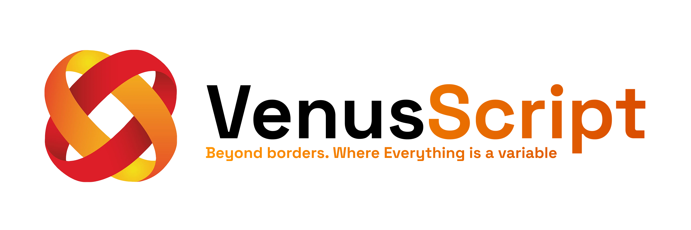

<div align="center">
    
  <p>
    
    
    
  </p>
</div>

## 🌌 What is VenusScript?

**VenusScript** (beta v0.1) is a modern, statically-typed programming language originally designed for the **FlareOS** ecosystem and the **VenusStudio 3D Engine**. It completely abandons the traditional, clunky distinctions between classes, functions, objects, and properties. 

In VenusScript, **everything is a variable**, creating a perfectly uniform, beautiful, and deeply nested syntax.

### ✨ Key Features
- **No Classes or `this`**: State, behavior, and namespaces are naturally managed by nesting variables inside other variables.
- **Systemic Types Built-In**: Types normally found in heavy libraries are integrated directly into the language syntax:
  - `tensor`: Native multi-dimensional arrays for Math and AI (`tensor weights(shape=[2, 2])`).
  - `buffer`: Low-level byte memory manipulation (`buffer data(size=1024)`).
  - `signal`: Built-in Observer pattern (`signal onClick()`).
  - `task`: Native async coroutines (`task myTask()`).
  - `vec2`, `vec3`, `vec4`: SIMD-ready mathematical vectors.
- **Pythonic Elegance, C-like Power**: Indentation-based scoping (4 spaces) with strict static typing.
- **Zero Hidden Conversions**: Types are extremely strict. An `int` cannot silently become a `float`.

---

## 🛠️ Installation & Building

Since VenusScript is written in **Rust**, you will need `cargo` installed.

### 1. Clone the repository
```bash
git clone https://github.com/FireInc/VenusScript.git
cd VenusScript
```

### 2. Build the Compiler / Interpreter
```bash
cd venus_compiler
cargo build --release
```

### 3. Install Globally (Windows)
We provide a PowerShell script to easily install the VenusScript CLI (`vscript`) globally on your Windows machine:
```powershell
.\install.ps1
```
Now you can run any VenusScript file from anywhere:
```bash
vscript my_script.vs
```

---

## 💻 VS Code Extension

VenusScript comes with a fully-featured **Visual Studio Code Extension** offering:
- Beautiful syntax highlighting
- Hover definitions (see variable types instantly)
- Go-to-Definition (Ctrl+Click to jump to source)
- Autocompletion

### How to install:
1. Open Visual Studio Code.
2. Go to the Extensions panel (`Ctrl+Shift+X`).
3. Click the `...` menu at the top right and select **Install from VSIX...**
4. Navigate to `vscode-extension/venusscript-1.0.0.vsix` in this repository and install it.

---

## 📖 Language Documentation

## 1. Core Philosophy: The Big List
VenusScript abandons traditional distinctions between classes, functions, objects, and properties. **Everything is a Variable.** The entire program is simply a structured list of variables.

There are no `this` or `self` keywords. State, behavior, and namespaces are naturally managed by nesting variables inside other variables.

---

## 2. The 4-Part Anatomy
Every entity in the code ALWAYS has a clear anatomy consisting of exactly 4 elements:
1. **Type**: Always comes first (e.g., `int`, `func`, `struct`, `object`).
2. **Name**: The identifier.
3. **Arguments (Optional)**: Passed STRICTLY in parentheses `()`.
4. **Content (Optional)**: Defined by 4-space indentation. `{}` and `;` are strictly forbidden.

## 3. Indentation & Syntax Rules
- Code blocks are formed exclusively by indentation (exactly 4 spaces or a tab).
- `()` are mandatory for arguments, even if empty (e.g., `func render()`).
- Commas `,` separate arguments.
- `#` begins a comment, extending to the end of the line.

---

## 4. Primitive Types & Data Structures

### 4.1. Primitives
```venusscript
int age = 21
float pi = 3.14159265
string companyName = "FireInc"
bool isOnline = true
```

### 4.2. Arrays
Arrays are dynamic, strictly typed collections.
```venusscript
string[] players = ["Ilya", "Stephen", "Max"]
players.push("Alex")

std.console.print(players[0]) # Output: Ilya
```

### 4.3. Vectors (SIMD Native)
Built-in types optimized for high-performance graphics and physics calculations. They support compound mathematical operations across all axes simultaneously.
```venusscript
vec3 position(0.0, 50.0, 0.0)
vec3 gravity(0.0, -9.8, 0.0)

# Native SIMD vector addition
position += gravity

vec4 color(r=1.0, g=1.0, b=1.0, a=1.0)
```

### 4.4. Advanced System Types (Memory & AI)
Types integrated directly into the parser and engine for LLVM/GPU hardware acceleration and systemic architecture:

- **buffer**: Low-level memory management. Created using `buffer data(size=1024)`.
- **tensor**: Multi-dimensional arrays for math and AI. Created using `tensor weights(shape=[2, 2], type="float32")`.
- **signal**: Built-in Observer pattern. Created using `signal onClick()`.
- **task**: Coroutines for async execution. Created using `task loadLevelAsync()`.
- **enum**: Memory-optimized state definition. Maps identifiers directly to integers `0, 1, 2...` for maximum performance.

```venusscript
enum ProcessState
    Idle
    Running
    Terminated

ProcessState currentState = ProcessState.Running
```

```venusscript
tensor weights(shape=[4096, 4096], type="float16")
buffer VertexBuffer(size=8192)
task loadLevelAsync()
signal onPlayerDeath()
```

---

## 5. Object-Oriented Design (Without Classes)

VenusScript uses objects as namespaces and isolated state environments. 

### 5.1. Object (State Containers)
An object can store variables and functions. Functions directly mutate the variables in their parent object's scope.
```venusscript
object Car
    float speed = 0.0
    float maxSpeed = 200.0
    
    # Implicitly mutates parent variables
    func accelerate(float amount)
        speed += amount
        if speed > maxSpeed
            speed = maxSpeed

# Instantiate a unique copy of the Car object blueprint
Car myCar()
myCar.accelerate(50.0)
std.console.print(myCar.speed.to_string()) # Output: 50.0
```

### 5.2. Struct (Pure Data)
Used for grouping memory-contiguous data without attached logic.
```venusscript
struct PlayerStats
    int health
    int mana
    int stamina
```

### 5.3. Behaviour (Interfaces)
`behaviour` is used to define contracts that objects must fulfill, similar to interfaces in C# or traits in Rust.
```venusscript
behaviour IDamageable
    func takeDamage(int amount)
```

---

## 6. Variable Mutation & Assignment

1. **Dot Notation**:
   ```venusscript
   playerPos.x = 150.5
   myCar.speed = 100.0
   ```
2. **Full Reassignment**:
   ```venusscript
   color = vec4(0.0, 0.0, 1.0, 1.0)
   ```
3. **Compound Mathematical Operators (`+=`, `-=`, `*=`, `/=`)**:
   ```venusscript
   points += 5
   playerPos += velocity
   ```

---

## 7. Built-In Native Methods

Instead of global functions, VenusScript relies on method calls natively bound to types:
- **String**: `.len()`, `.upper()`, `.lower()`, `.contains("text")`, `.split(",")`, `.to_int()`.
- **Array**: `.len()`, `.push(item)`, `.pop()`.
- **Int / Float**: `.abs()`, `.to_string()`.
- **Vectors**: `.to_string()`.

---

## 8. Modules and `export`

To make a variable accessible outside its file, prefix it with `export`.
**Golden Rule of Exports**: If you export a container (`object`, `class`, `struct`), ALL variables and functions inside it are **automatically exported**.

```venusscript
# std.vs
export object class

export class console
    func print(string msg) # Automatically exported!
    func log(string msg)
```

Usage in another file:
```venusscript
import std
std.console.print("Hello!")
```

---

## 9. Functions and Control Flow

Functions are just variables of type `func`.
```venusscript
func calculate(int a, int b) -> int
    return a + b
```

### 9.1. Passing by Reference (`ref`)
To modify a variable inside a function without copying it, use the `ref` keyword:
```venusscript
func updatePosition(ref vec3 pos)
    pos.x += 10.0
```

Control flow is highly readable:
```venusscript
if power > 100
    std.console.print("High")
elif power == 100
    std.console.print("Normal")
else
    std.console.print("Low")

for player in players
    std.console.print(player)

while timer > 0
    timer -= 1
```

---

## 10. Hardware Decorators

Decorators provide low-level hardware orchestration.
- `@hardware.GPU` / `@hardware.TPU` - Compiles the block directly for GPU/TPU architectures.
- `@hardware.NVIDIA` - Isolates the logic for local AI model execution (ensuring privacy and raw power without cloud dependency).
- `@memory.pinned` - Prevents RAM relocation by the OS kernel.

```venusscript
@hardware.NVIDIA
func runLocalAI(string model_path) -> string
    return inference(model_path)
```

---
---

## 11. Practical Use Cases & Examples

With its current feature set, VenusScript is highly capable of defining complex logic architectures. Here are examples of what can be built right now.

### Example A: 3D Engine Physics Calculation
Because of native SIMD vector support, writing physics calculation loops is mathematically clean and concise.

```venusscript
import std

object PhysicsEntity
    vec3 position(0.0, 100.0, 0.0)
    vec3 velocity(0.0, 0.0, 0.0)
    vec3 gravity(0.0, -9.81, 0.0)
    float mass = 10.0

    func applyForce(vec3 force)
        vec3 acceleration = force / mass
        velocity += acceleration

    func tick(float deltaTime)
        # Apply gravity continuously
        velocity += (gravity * deltaTime)
        # Update physical position in 3D space
        position += (velocity * deltaTime)

# Engine Loop Simulation
PhysicsEntity player()
player.applyForce(vec3(50.0, 0.0, 0.0)) # Push player right

int frame = 0
while frame < 60
    player.tick(0.016) # 60 FPS delta time
    frame += 1

std.console.print("Final Player Position:")
std.console.print(player.position.to_string())
```

### Example B: Neural Networks & Data Science
Using the AST's `tensor` types and hardware decorators, VenusScript can define AI architectures intended for GPU compilation.

```venusscript
import std

class NeuralNetwork
    tensor inputLayer(shape=[1, 768], type="float32")
    tensor hiddenWeights(shape=[768, 4096], type="float16")
    tensor outputWeights(shape=[4096, 10], type="float16")
    
    @hardware.GPU
    func reluActivation(ref tensor data) -> tensor
        # Mock activation logic
        return data

    @hardware.NVIDIA
    func forwardPass(tensor inputData) -> tensor
        tensor hidden = inputData * hiddenWeights
        tensor activated = reluActivation(hidden)
        tensor output = activated * outputWeights
        return output

# Initialization
std.console.print("Initializing AI Model Weights...")
NeuralNetwork model()

# Mock Inference
tensor mockImage(shape=[1, 768], type="float32")
tensor prediction = model.forwardPass(mockImage)
std.console.print("Inference completed successfully.")
```

### Example C: Operating System (FlareOS) Process Management
VenusScript utilizes `task` and `signal` types (currently mocked in evaluation) to represent system-level thread execution.

```venusscript
import std

object Process
    int pid = 0
    string processName = ""
    bool isRunning = false
    
    func start()
        isRunning = true
        std.console.print("Process started: " + processName)
        
    func terminate()
        isRunning = false
        std.console.print("Process killed: " + processName)

class ProcessManager
    Process[] activeProcesses = []
    
    func spawn(string name) -> Process
        Process newProc()
        newProc.pid = activeProcesses.len() + 1000
        newProc.processName = name
        activeProcesses.push(newProc)
        newProc.start()
        return newProc

ProcessManager OS()

# Simulating OS runtime
Process shell = OS.spawn("FlareTerminal")
Process backgroundService = OS.spawn("NetworkDaemon")

std.console.print("Active Processes Count:")
std.console.print(OS.activeProcesses.len().to_string())

shell.terminate()
```

---

## 12. 🚀 Roadmap (The Journey of VenusScript)

We are actively building the ultimate high-performance language. Here is a detailed look at what we've achieved so far and where we are heading next:

### ✅ Phase 1: Core Foundation & Language Syntax (v1.0.0 & v1.1) — COMPLETED
- [x] **Lexer & Parser Architecture**: Full AST generation with strict indentation-based scoping.
- [x] **"Everything is a Variable" Paradigm**: Complete elimination of `class` and `this` in favor of deeply nested, uniform structures.
- [x] **VS Code Extension**: Syntax highlighting, keyword support (including `from`), Hover, and Goto-Definition.
- [x] **Semantic Analyzer (Type Checker)**: Strict type-checking, return type verification, and a Human-Readable Error Engine with precise line tracing.
- [x] **Memory-Optimized Enums (v1.1)**: Blazing-fast state checking using integer-mapped `enum` types.
- [x] **Native Systemic Types**: Initial AST bindings and syntax parsing for `tensor`, `buffer`, `signal`, and `task`.
- [x] **Module System**: `import` and `from ... import *` functionality, allowing modular coding.

### 🚧 Phase 2: AOT Compilation & LLVM (IN PROGRESS)
The Rust interpreter is perfect for prototyping, but FlareOS requires maximum speed.
- [ ] **LLVM IR Generation**: Translating the AST directly into LLVM Intermediate Representation.
- [ ] **Hardware SIMD Vectors**: Compiling `vec2`, `vec3`, and `vec4` operations directly into native CPU SIMD instructions for lighting-fast math.
- [ ] **Advanced File System Modules**: Native file path imports (e.g., `import fs.renderer.camera` instead of just the standard library).
- [ ] **Memory Management Backend**: Implementing the low-level logic for `buffer` to directly read/write raw memory bytes safely.

### 🌟 Phase 3: GPU, AI, & Tensor Integration
Bringing the power of AI and Data Science natively into the language syntax without relying on massive external libraries like PyTorch.
- [ ] **Vulkan/CUDA Compute Backing**: Implementing the underlying computational engine for `tensor` operations.
- [ ] **Hardware Decorators**: Full execution routing for `@hardware.GPU` and `@hardware.NVIDIA` to run specific code blocks directly on the GPU.
- [ ] **Native Backpropagation**: Providing language-level support for calculating gradients on `tensor` types.

### 🌟 Phase 4: Concurrency & Game Engine Interop (VenusStudio)
Designed specifically to make game development and OS management seamless.
- [ ] **Lock-Free Multithreading**: Hooking `task` and `signal` into a background worker pool, allowing games to run heavy network or physics logic without freezing the main thread.
- [ ] **Network Synchronization Tags**: Adding variable traits like `net_sync` to automatically replicate states across server and clients.
- [ ] **AST Hot-Reloading**: Replacing specific branches of the AST at runtime without restarting the application, allowing instant live-coding within the VenusStudio editor.
- [ ] **Time-Based Execution**: Native syntax integration for game timers (e.g., `wait 5.seconds`).

---

## 📄 License
This project is licensed under the MIT License - see the [LICENSE](LICENSE) file for details.
